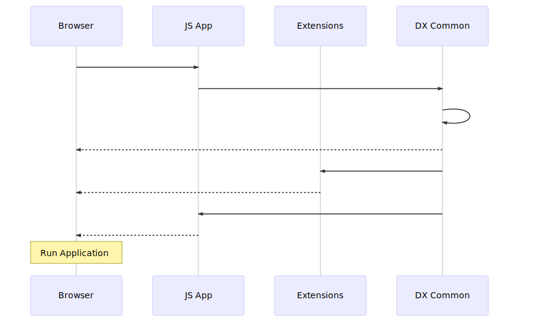

DX commons Webpack
==================
This module provide shared components using [dll](https://webpack.js.org/plugins/dll-plugin/) for webpacked js application. These components will be use by webpack
## Build Sequence
You need first to build the `dx-common-webpack` module using `mvn install`. This will generate a manifest `dx-commons-webpack-x.x.x-SNAPSHOT-manifest.json` that will be used by application and extensions to know the shared packages.
Next for each project, add a maven dependency to this project:
```
        <dependency>
            <groupId>org.jahia.modules</groupId>
            <artifactId>dx-commons-webpack</artifactId>
            <version>1.0.0-SNAPSHOT</version>
            <type>json</type>
            <classifier>manifest</classifier>
        </dependency>
```  
To load the manifest while building the application or the extension. 
## Set up 
In your DX view that loads the js application you need to add 
```
<template:addResources type="javascript" resources="js-load.js"/>
```
To provide `bootstrap()` function that will load the shared and the required resources provided as argument (as an array of javascript file).
for example:
```
    bootstrap(['/modules/content-editor/javascript/apps/content-editor-ext.bundle.js', '/modules/content-media-manager/javascript/apps/cmm.bundle.js']);

```
_Note: This will be replaced by a custom tag that will do all the work._
## Execution Sequence

__explanations:__
The call to `bootstrap()` will first load all the shared js modules provided by `DX Common Webpack`

In `/dx-commons-webpack/src/main/resources/javascript/js-load.js`:
``` 
var scriptTag = document.createElement('script');
    scriptTag.src = window.contextJsParameters.contextPath + '/modules/dx-commons-webpack/javascript/apps/commons.bundle.js';
```
    
Then load all the extensions

In `/dx-commons-webpack/src/javascript/main.js`:
```
    let jsloads = js.slice(0, js.length - 1).map(path => {
        return jsload(path);
    });
```
To finally loads the application itself:
```
    Promise.all(jsloads).then(() => {
        jsload(js.slice(js.length - 1));
    });
```
Once everything is loaded, the application works as if all resources were provided by one single module.
